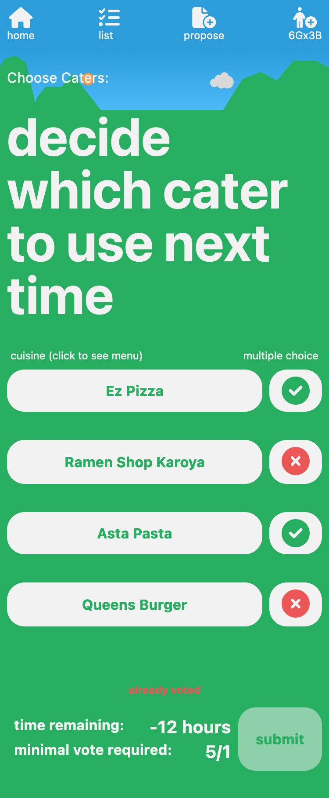
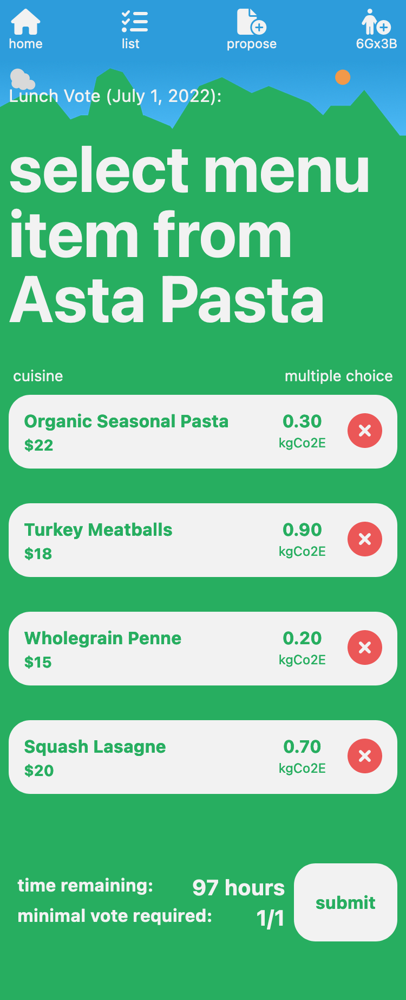
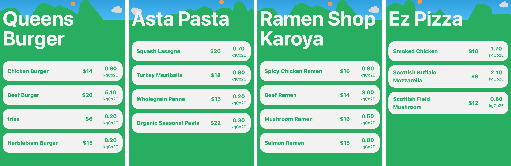

# BENTO DAO

video introduction
https://youtu.be/bhO6YiJYKaM

# Where you can find it
[https://famous-choux-512742.netlify.app/](https://famous-choux-512742.netlify.app/)

It is advised to use the [Phantom wallet](https://phantom.app/), since it was used for testing.
(let me know if you want to try it out, I need you to be **registered as a member**. More on this later.) 

# what it is

## Blockchain - Solana

BENTO DAO is a dApp deployed in the [Solana](https://solana.com/) devnet. Solana is an environmentally friendly, fast, and cheap Blockchain.

|            | Ethereum | Solana   |
| ---------- | -------- | -------- |
| speed      | - 3min   | - 12 sec |
| tx cost    | $ 10     | $ 0.001  |
| market cap |      2nd |     10th |
| consensus  | PoW*     |    PoS   | 

*: Ethereum will shift to PoS eventually. 

There are also differences in smart contract development, but the main reason is the speed and the cost of each interaction.

## Social Choice function - Approval Voting

I have [previously](https://github.com/namaph/namaph-multisig) worked on a multisig-based DAO. Since my main claim towards current DAOs is that they are too simplistic when counting the votes, I choose Approval Voting for this step as a natural step. Approval voting enables you to pick Approval / Denial within multiple options. It is used for elections in different nations
and has been popular among social choice theorists. Some say AV renders more voter satisfaction than IRV and is extensible to other methods. However, it is not perfect. One critique is that you cannot express different levels of approval among them. This tradeoff leads to another reason I have chosen AV since this aspect may work for the topic of selecting lunch menus. AV can be used to **acquit** bad choices and is a good match for this application. For example, if you chose a high-impact burger (5.0 kgCo2e), you can
approve another lighter Salad (0.2 kgCo2e; it May not be preferable to the burger but better than the other alternatives) to balance it out rather than selecting something in the middle. Looking at these voting behaviors will let the community know which menus are acceptable. 

So far, I have not seen any DAOs that use approval voting. 

# what it is not

From the main reason for having a short development period, these aspects are put aside that a typical DAO project might have.

## 1. Member Registration
Deciding who to be in that community is already a decision that has an impact. Once one user establishes a DAO, it is usual to "vote-in" the following user. Again my [multisig DAO](https://github.com/namaph/namaph-multisig) implementation has this feature, but I chose to skip this since it not only slows down the development but also hinders the test process.

## 2. Upgrade Authority
a DAO should rewrite itself from the demand of the community. For example, the Approval Voting method may not be the best aggregation rule, and constituencies may implement and favor IRV. A DAO should be able to swap the smart contract binary to the new one. I have also skipped this for the same reasons as Member Registration. The capability of rewriting the underlying smart contract is not the central focus of selecting lunch and will hinder the testing process.

# tiny experiment

## Caters and Meal Items

The menu was heavily inspired from below: 
https://arecipeforchange-cop26.co.uk/menus

In specific, the options are shown below:

## participants

I recruited five people from the group to try the app. 
The theme was a hypothetical setting to decide next week's cater and menu.

## results

For the cater, the group selected, "Ez Pizza" and "Queens Burger",
and for the subsequent menu poll, "Beef Burger" and "fries" won.

# feedback and discussions

## delegation

One idea is to have more innovative ways to 'delegate.' People asked for delegation already. People may miss the voting period or do not care what they eat. The option to proxy their vote makes it easy for some people. If broadly the community agrees to reduce CO2, the system may have a default setting to delegate to members that regularly choose small impact meals. In other words, this opt-out mechanism will work as a stronger abstention vote. 

There are similarities when the system chooses a 'good' delegate and Proof of Stake. The system chooses a node holding a substantial stake, and malicious acts will degrade trust in that blockchain itself, which is also what the node will want to avoid.

## non-participation

Incentive mechanisms lack in actually participating in the lunch. It is now customary to remotely participate in meetings and may make people choose remote, knowing the poll results will not reflect their preference. Whether the group favors in-person meetings is another story, but the decision the DAO makes may affect the total order number.

## Food loss
From an admin point of view, it is better to know an accurate headcount; usually, it will have extra orders, which leads to loss. In the context of the lab, Food Cam is used to counteracting the surplus, but the DAO controlling the amount of surplus may be another topic.

